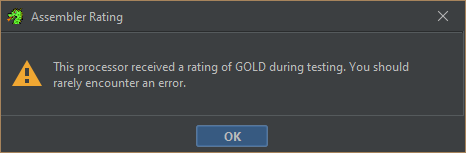
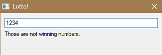

For my final project I set out to complete the Lotto.exe challenge from SkidCTF. This challenge is a reverse engineering challenge which is ranked as very hard. My former teacher said it took them the better part of a week. It's a challenge which I was not sure I could complete, going into it.
### Setup

I installed a C toolchain with MinGW so that I could play around with C compilation. I figured it would help me reason about the relationship between C and assembly. I got a little confused by the proliferation of different toolchains for C compilation on Windows, but I followed the recommendation of the C/C++ extension for VSCode and used MinGW.

I also updated my installation of Ghidra, which was the main tool I used. It shows the assembly for the application in a readable format, and supports decompilation to C and other analysis. The NSA made some significant improvements to the UI since I last updated, including adding support for color themes. My eyes were very grateful. I also used IDA, which is similar to Ghidra. I used it for dynamic analysis (debugging) since setting that up in Ghidra is difficult. I mainly used Ghidra because I'm more familiar with it.
### Getting Started

Lotto.exe is a GUI based application in the Windows Portable Executable (PE) format. In it, you can enter the number for a lottery, and the application will tell you if you have the winning number. The goal is to enter the winning ticket and recieve the flag as a reward. In order to figure out what number is the winning one, I needed to dig into the code.

The app looks like this:


When I entered a value, it said "you cannot buy a lotto ticket without money"


I didn't how I was supposed to get money. This text box is the only way of interacting with the app. I tried entering a command line argument when launching the application, but it didn't do anything.

I imported the file into Ghidra and got a description of the file. The only noteworthy info was that the compiler is visualsutdio:unknown, which indicates that the app was compiled with Microsoft Visual Studio. Visual Studio is used to compile C and C++ code for Windows. I wanted to know whether the app was programmed in C or C++ but it turns out it's not trivial to determine that. You have to look for hints like artifacts from C++ objects and C++ name mangling. I didn't see any of that, so I came to the conclusion that lotto is a C program. Not that it matters much. It always decompiles to C. You can even decompile programs written in languages not in the C family as long as they're compiled.

I opened lotto.exe in the code viewer and clicked "analyze" which decompiled it into C. This is what it looks like in Ghidra:


Assembly is on the left and decompiled code is on the right. Selecting elements on either side will highlight the corresponding element (if there is one) on the other side. The highlight feature is helpful, but not very reliable.

As I was looking through the file I was struck by how big it is. It spans 37,544 memory addresses. Of course, most of them weren't relevant to solving the challenge. Otherwise this would have been impossible. The majority of the file is comprised of functions. The functions range in size from more than a hundred lines to a single line. 

One of the things which makes reverse engineering hard is that compilation is a lossy process. Most variable and function names, program flow, most comments, and other features of the source code are gone. This means that for each function, I had to look at what was happening in it and reason about it's purpose or role in the program.

The first function in the file is `entry`, which is the top level function of the application. All of the other functions are unnamed and Ghidra gives them names like `FUN_0040204c`. I used the symbol tree to confirm that there are in fact, quite a few functions. Around 150. I took a cursory look at many of the functions and determined that most fall into three categories:

- Program logic
- GUI and IO
- Memory management

I was concerned with the logic of the program and not the other elements, so part of the challenge was to find which functions governed the logic. The method I used was top-down analysis. I started at the `entry` function and recursively analyzed the functions called in it.

`entry` has a main loop where the meat and potatos of the app are. Here's the loop, with comments describing what I thought each part did when first going through it.

```C
  do {
    DAT_0040ad9c = FUN_004042fc();
    if (((DAT_0040ad9c == 0x332c) && (iVar1 = FUN_00405bf3(), iVar1 == 1)) &&
        (iVar1 = FUN_00405c02(), iVar1 == 0x300)) {
      if (DAT_0040ada0 == 0) { //blocks you from entering a ticket if money = 0
         FUN_004039db((int *)0x3,u_You_cannot_buy_a_lotto_ticket_wi_0040a060);
      }
      else {
         iVar1 = DAT_0040afcc;
         FUN_00403a26((int *)0x1,DAT_0040afcc);
         FUN_00407620(&DAT_0040ad98,iVar1);
         uVar2 = FUN_00402000(DAT_0040ad98);
         if ((int)uVar2 == 0) { //This checks if the lotto number is correct or not
           FUN_004039db((int *)0x3,u_Those_are_not_winning_numbers._0040a022);
         }
         else { //Displays the flag, which is encoded somehow
           iVar1 = DAT_0040afcc;
           iVar3 = DAT_0040afcc;
           iVar4 = DAT_0040afcc;
           uVar2 = FUN_00403040((ushort *)DAT_0040ad98);
           uVar2 = FUN_004021df((int)uVar2);
           FUN_00405710((short *)uVar2,iVar1);
           DAT_0040afcc = DAT_0040afcc + 2;
           FUN_004039db((int *)0x3,(LPCWSTR)(iVar3 + DAT_0040a140));
           DAT_0040afcc = iVar4;
         }
      }
    }
  } while (DAT_0040ad9c != 0x333c); //determines whether the loop continues
```

An important tool in reverse engineering is to give variables descriptive names. As I worked, I changed the names of variables to reflect my understanding of them. For example, I renamed `DAT_0040ad9c` to `main_loop_value` because it detemines if loop continues and I renamed `FUN_004039db` to `display_text` since it displays text. I went into each function and gave most of them descriptive names.

```C
...
  memset(&DAT_0040ad88,0,0x20);
  DAT_0040ad8c = GetModuleHandleW((LPCWSTR)0x0);
  DAT_0040ad88 = HeapCreate(0,0x1000,0);
  heap_stuff();
  entry_data_structure_stuff_1();
  create_window();
  tls_alloc_proxy();
  make_heap_2();
  heap_stuff?();
  heap_stuff_2();
  windows_stuff();
  load_assets();
  more_initialization();
  money_amount = 0;
  DAT_0040ad90 = 0x7a6a;
  FUN_00403008((LPVOID *)&DAT_0040ada4,(undefined4 *)&DAT_0040a0f2);
  _OOBECompleteWnfQueryCallback@28((HWND__)0x0,0,0,0x142,0x56,u_Lotto!_0040a0e4,0xc80001);
  FUN_0040363f((HWND)0x1,8,10,0x132,0x14,(LPCWSTR)&DAT_0040a020,0x2000);
  FUN_004039bb((HWND)0x3,8,0x23,0xce,0x28,u_Enter_a_lotto_number!_0040a0b8);
  do {
    main_loop_value = get_window_info_proxy();
    if (((main_loop_value == 0x332c) && (iVar1 = FUN_00405bf3(), iVar1 == 1)) &&
        (iVar1 = FUN_00405c02(), iVar1 == 0x300)) {
      if (money_amount == 0) {
         display_text((int *)0x3,u_You_cannot_buy_a_lotto_ticket_wi_0040a060);
      }
      else {
         iVar1 = int_1;
         FUN_00403a26((int *)0x1,int_1);
         FUN_00407620(&DAT_0040ad98,iVar1);
         target = check_lotto(DAT_0040ad98);
         if ((int)target == 0) {
           display_text((int *)0x3,u_Those_are_not_winning_numbers._0040a022);
         }
         else {
           iVar1 = int_1;
           iVar3 = int_1;
           iVar4 = int_1;
           uVar2 = FUN_00403040((ushort *)DAT_0040ad98);
           uVar2 = FUN_004021df((int)uVar2);
           FUN_00405710((short *)uVar2,iVar1);
           int_1 = int_1 + 2;
           display_text((int *)0x3,(LPCWSTR)(iVar3 + allocated_heap_1));
           int_1 = iVar4;
         }
      }
    }
  } while (main_loop_value != 0x333c);
```

At this point, I realized why I was getting the message "You cannot buy a lotto ticket with no money". The `money_amount` variable is set to 0. `money_amount` is only written to once, so seemed like it would be impossible to satisfy this requirement.

Luckily, Ghidra can patch the instructions and change the code.


As shown above, I modied the assembly where `money_amount` is set to 0 to set it to 200 instead. I got a strange popup upon clicking "Patch instruction" (shown below). I'm not sure what my processor has to do with encountering errors when patching, but I am obviously no expert.



I exported and ran the patched file. When I entered a number, I got a different message than before. The patch worked!



With a successful path under my belt, I decided to try patching the app to just give me the flag. I didn't expect it to work, though. It would be too easy.

The if statement which checks if the lotto number is correct uses the instruction JZ which means "Jump if Zero". I changed JZ to JNZ which jumps if not zero. The patch inverted the if statement, so it should print the flag if I get the lotto number wrong. 

The patched instructions:


And the new decompiled code, which has the if statement inverted:


Did it work?

Nope. Of course it's wouldn't be that easy. Entering a number in the modified app caused it to print gibberish. When I entered a second number, it crashed.


As I suspected, the process which outputs the flag uses the input, so it must be correct for the flag to be revealed.

### The Hard Part

This part of the writeup is less step-by-step because I took a while to meander around the code and slowly build up my understanding. Instead of documenting in detail, I'll give examples of the challenges I faced deciphering the app.

Whether because of the decompilation process or the nature of C code (and my limited knowledge of the language), many of the functions were difficult to understand. For example, the following function returns a void pointer containing the memory address of allocated memory in the heap. It casts the function pointer param_2 to the code type if it isn't a null pointer, then executes the function it points to with the pointer to the heap as a parameter. Not the most intuitive, I think.

```C
LPVOID FUN_00406f3a(SIZE_T param_1,undefined *param_2)
{
  LPVOID pvVar1;
  
  pvVar1 = HeapAlloc(DAT_0040ad88,8,param_1);
  if (param_2 != (undefined *)0x0) {
    (*(code *)param_2)(pvVar1);
  }
  return pvVar1;
}
```

The C compiler makes optimizations which can make for strange C code when decompiled. For instance, an allocation on the stack may be used multiple times for different purposes, which gets decompiled to a local variable which is assigned and read multiple times for entirely unrelated purposes. In `entry`, as shown below, the variable `iVar1` is assigned and read multiple times for totally unrelated purposes.


One of the things I did was figure out what each of the global variables (shown in dark green in Ghidra screenshots) are used for. Often I had to look at multiple functions using the same variable to do so. For instance, I found one global variable which is repeatedly used in memory related functions and I determined that it's a pointer to an allocated section on the heap.

As days went by, the satisfaction of gaining understanding of the app was replaced by growing frustration with the elements I still did not understand. Eventually, I would break through the hurtles and sometimes moments of realization felt like ephiphanies. I finally grasped the entirety of how pointers work, after using C for multiple years here and there.

The most important function in lotto.exe beside `entry` is `check_lotto`, which determines if the program displays "those are not the winning numbers" or attempts to display the flag. Unfortunately for me, this function has numerous features which I couldn't make heads or tails of.

```C
undefined8 check_lotto(undefined4 *String) {
  undefined4 extraout_ECX;
  undefined4 extraout_EDX;
  undefined8 int_1;
  ushort *pointer_to_string_on_heap;
  int int_2;

  int_2 = 0;
  pointer_to_string_on_heap = (ushort *)0x0;
  allocate_heap_and_copy_string_proxy(&pointer_to_string_on_heap,String);
  int_1 = string_to_int(pointer_to_string_on_heap);
  int_2 = (int)int_1;
  rearrange_bytes_in_int(int_2);
  int_1 = FUN_004076a0(extraout_ECX,extraout_EDX,pointer_to_string_on_heap);
  return int_1;
}
```

This function takes a pointer to the string which is taken from the text input box in the app. It makes a copy of the string on the heap, and uses that copy to find the value of the string as a number. It makes a copy of the number in `int_2`, which gets passed to a function that rearranges the bytes in it. However, `int_2`is never used or returned. I was baffled by this.

Additionally, `extraout_ECX` and `extraout_EDX` are passed to `FUN_00407a0` without being initialized, and furthermore, they aren't even used in the function they're passed to. This is the function in question:

```C
undefined8 __fastcall FUN_004076a0(undefined4 param_1,undefined4 param_2,LPVOID param_3)
{
  undefined4 in_EAX;
  if (param_3 != (LPVOID)0x0) {
    HeapFree(heap_1,0,param_3);
  }
  return CONCAT44(param_2,in_EAX);
}
```

`CONCAT44` doesn't link to a function, but it's also not marked as an external function. I looked it up and it apparently concatenates two 32 bit values (44 I guess is for 4 bytes + 4 bytes). `param_2` and `in_EAX` are still uninitialized, though.

I realized that while the other functions are `__stdcall`, this one is `__fastcall`, meaning it takes values on registers as parameters. That explained why the variables going uninitialized were named after registers. I still didn't understand this and the `check_lotto` function, however.

I didn't know which values are being concatenated because those registers are used in multiple functions in `check_lotto`. At this point, I had avoided looking at the assembly in favor of the decompiled C. I barely knew what the instructions did and how they interacted, especially with the stack and parameters and such. I studied up on it, and found that there was a whole treasure trove of information I was ignoring. I realized that `CONCAT44` simply returns the values for `int_1` to the registers it's stored on in check_lotto, since those registers are used in the function and `int_1` is stored on the stack in the meantime. It isn't used in this function, but it needs to get passed anyway to preserve it. In the assembly, you can see EAX and param_2 (EDX) get pushed onto the stack and popped off of it at the end.


I still wasn't able to understand how `check_lotto` worked. It returns 1 if the lotto number entered is right and 0 otherwise. But it's behavior doesn't line up with that. It seems to just convert to int, shuffle some bits, and then append something else to it. It didn't add up.

It turned out, there is a conditional jump in the assembly for check_lotto!! Apparently sometimes the decompiler just doesn't work correctly and skips over stuff like this. I realize that writing a decompiler is very hard but this was very confusing and frustrating. The highlighted `JNZ` instruction below wasn't represented in the control flow of this function in C. 


I then mostly understood how the function works. `MOV EBX, int_1` copies the value from int_1 onto the general purpose `EBX` register. `CMP` compares the value of `int_1` in the `EBX` register and `DAT_winning_lotto`, a self-explanatory global variable. If they're the same, the Zero Flag (ZF) is set to 1, othersize it's set to 0. Then `JNZ` checks the flag and jumps to `LAB_00402037` if it's 1. The result is that the function has an if/else functionality with two branches. The branches set `int_1` to 0 or 1 respectively. This value is returned and represents whether the lotto number was correct or not.


### I figured it out. Here's what each line does

PUSH      EBX      
_saves a value from the calling function for later_

XOR       EAX,EAX    
_sets EAX to 0_

PUSH      EAX    
_adds a 0 to the stack to use as a parameter_

PUSH      EAX    
_adds another one_

MOV       EDX,dword ptr [ESP + String]    
_copies the pointer to the input string to EDX_

LEA       ECX=>pointer_to_string_on_heap,[ESP]    
_copies the adress at the top of the stack to EXC, essentially making a pointer to the second 0_

CALL      allocate_heap_and_copy_string_proxy    
_copies the string to the heap and uses the pointer in EXC to make the element on the stack a pointer to it_

PUSH      dword ptr [ESP]=>pointer_to_string_on_heap    
_makes a copy of the string-on-heap pointer on the stack to use as a parameter_

CALL      string_to_int    
_turns it into an int, which goes on EDX and EAX because ints are 64 bits and registers are 32_

MOV       dword ptr [ESP + int_2], int_1    
_copies the int stored in EDX and EAX (which are collectively int_1) onto the other 0 on the stack_

PUSH      dword ptr [ESP + int_2]    
_makes a copy of int_2 on the stack_

CALL      rearrange_bytes_in_int    
_swaps the positions of the 2nd and 4th bytes in the provided 32 bit int, such that a,b,c,d becomes d,a,c,b. This value is returned onto EAX_

MOV       EBX,int_1
_copies EAX onto EBX_

CMP       EBX,dword ptr [DAT_winning_lotto]
_checks if ebx is equal to the global value DAT_winning_lotto, which is set in entry(). If it is, the Zero Flag (ZF) is set to 1, otherwise 0

JNZ       LAB_00402037
_jumps if ZF is not 0_

MOV       int_1,0x1
_sets int_1 (the return value) to 1, indicating a match_

JMP       LAB_0040203d
_goes to end of function_

LAB_00402037
XOR       int_1,int_1
_zeroes int_1_

JMP       LAB_0040203d
_goes to end of function_

LAB_0040203d
PUSH      dword ptr [ESP]=>pointer_to_string_on_heap
_sets up pointer to string as a parameter_

CALL      free_heap
_frees the allocated memory for the string_

ADD       ESP,0x8
_shinks stack_

POP       EBX
_retrieves this from storage at the start of the function_

RET       0x4
_returns with int_1 in EAX

### Home Stretch

At this point I had a good idea of what number I needed to enter. The number would need to be equal to another global variable - which is 7a6a in hex - after having it's bytes rearranged. The rearrange function swaps the bytes in the number such that bytes a,b,c,d become c,d,a,b.

```C
  return (int)(char)param_1 << 0x10 | (param_1 >> 0x18) << 8 | (param_1 << 8) >> 0x18 |
         ((param_1 << 0x10) >> 0x18) << 0x18;
```

I wrote this program to find the value by brute force since I wasn't sure how to program the byte swapping the opposite way and this was easier.

```C
#include <stdio.h>
#include <stdint.h>

uint32_t rearrange_bytes(uint32_t param_1) {
    return (uint32_t)(uint8_t)param_1 << 16 | //d -> b
           (param_1 >> 24) << 8 | //a -> c
           (param_1 << 8) >> 24 | //b -> d
           ((param_1 << 16) >> 24) << 24; //c -> a
} //a,b,c,d -> c,d,a,b

int main() {
    uint32_t target = 0x7a6a;
    uint32_t found = 0;
    uint32_t test;
    for (test = 0; test <= 0xFFFFFFFF; test++) {
        if (rearrange_bytes(test) == target) {
            found = test;
            break;
        }
    }
    if (found != 0) {
        printf("Found matching integer: 0x%08X (decimal: %u)\n", found, found);
    } else {
        printf("No matching integer found.\n");
    }
    return 0;
}
```

One it ran it, it became obvious that I didn't need to write this. Swapping the bytes is as easy as shuffling them around. Well, I did need it to convert to decimal since I can't enter the number as hex. Interestingly, the number parsing function does allow hex, but it must be preceded by a $ and the textbox only allows numbers. Also, this ended up being the only thing I used C for funnily enough.


I was hoping that this would work and I would finally be done, but alas, it didn't work. I didn't know what I was doing wrong. In desperation, I turned to IDA and used the debugger to try to see what was going on. It confirmed that my understanding of the code was correct, but the value I had was wrong. I double checked the logic and it seemed to be correct. I was still stumped. Finally, I read through the code again and realized... _I entered the wrong value for the constant._ Classic programmer error.

The IDA debugger (actually the best of any debugger I've used so far):


I tentatively entered my new value...

It worked!


### Reflection

I spent a week doing this and little else. It was demoralizing at times, and I had to resist the urge to give up. I knew it would be a challenge going in as a relative beginner, and it was. I'm glad I stuck with it, both to get credit, and for the personal growth and accomplishment.

In retrospect, the challenge seems not too difficult. The relevant code wasn't very complex. I feared it would be much worse. Rather, the challenge came mostly from sifting through the heaps of functions to find the relevant ones. I also was afraid that If I totally neglected to understand the memory management functions, I would have issues. That ended up not being a problem, but in a harder challenge it could have been. The other reason it seems easier in retrospect in that I learned a lot about C and assembly doing this. I'm a lot more capable at reverse engineering and low-level programming than when I started.
